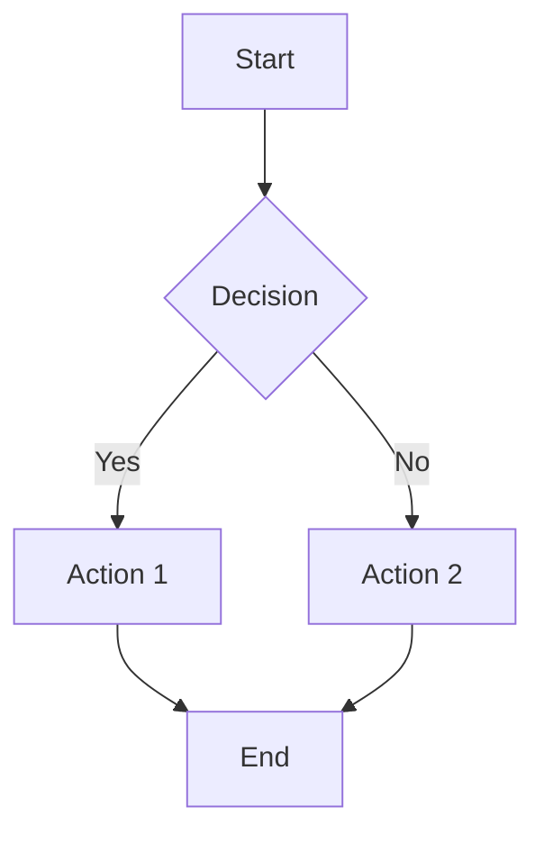

# Sample Document

This is a **sample** markdown file used for testing MDViewer.

## Features Tested

### Inline formatting

Bold **text**, _italic_, ~~strikethrough~~, and `inline code`.

### Code Block

```javascript
const greeting = 'Hello, World!';
console.log(greeting);
```

```python
def greet(name):
    return f"Hello, {name}!"
```

### Table

| # | Name    | Value |
|---|---------|-------|
| 1 | Alpha   | 100   |
| 2 | Beta    | 200   |
| 10 | Gamma  | 300   |
| 11 | Delta  | 400   |
| 12 | Epsilon| 500   |

### Task List

- [x] Task 1 — complete
- [ ] Task 2 — pending
- [x] Task 3 — complete

### Blockquote

> This is a regular blockquote.

> [!NOTE]
> This is a GitHub-style note admonition.

> [!WARNING]
> This is a warning admonition.

> [!TIP]
> This is a tip admonition.

> [!IMPORTANT]
> This is an important admonition.

### Mermaid Diagram



### Nested lists

- Item 1
  - Subitem 1.1
  - Subitem 1.2
- Item 2
  1. Ordered sub 1
  2. Ordered sub 2

### Links

- [External link](https://example.com)
- [Anchor link](#features-tested)

### Image


---

End of sample document.
